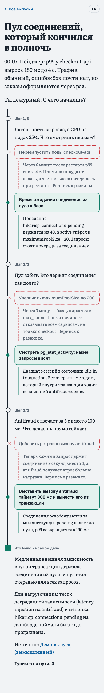
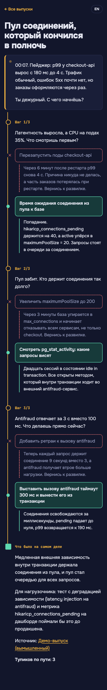

# Дизайн: вариант A «Постмортем» (на согласовании)

Сейчас на сайте вариант **B «Ночная смена»**. Вариант A — альтернатива, её обсуждаем с участниками.

| A «Постмортем» | B «Ночная смена» (текущий) |
|---|---|
|  |  |

## Общее у обоих вариантов

Разметка и движок (`player.js`) одинаковые, отличается только `style.css`.

- Слева идёт хребет расследования, на нём узлы шагов.
- Неверный выбор остаётся пунктирной красной веткой с ✕ и последствием.
- Верный ход отмечен сплошной зелёной линией.
- После решения шага нетронутые варианты скрываются. В финале видно, каким маршрутом шёл читатель и в какие тупики сворачивал.

## Чем A отличается от B

| | A «Постмортем» | B «Ночная смена» |
|---|---|---|
| Настроение | Разбор утром после инцидента, спокойный документ | 03:12, сработал пейджер |
| Тема | Светлая, тёмная по системной настройке | Только тёмная |
| Текст истории | Literata (с засечками) | Onest |
| Интерфейс и варианты | Golos Text | Onest, номера шагов JetBrains Mono |
| Вступление | Крупный абзац документа | Карточка алерта с мигающей точкой |
| Хребет | Чернильный `#18212C` | Янтарный `#F5B53F` |

## Токены A

Светлая тема: бумага `#F1F3F5`, чернила `#18212C`, вторичный текст `#5A6572`, линии `#CDD3DA`, тупик `#C8323A`, верный путь `#0E7C66`, ссылки `#0E5F9E`.

Тёмная тема: фон `#161B22`, текст `#E6E9ED`, хребет `#C9D1DA`, тупик `#F2777E`, верный путь `#4CC7A6`, ссылки `#7FB8E6`.

## Как переключиться на A

1. В `style.css` удалите правила `.intro`, `.intro::before` и `@keyframes page` в конце файла.
2. Замените строку `@import` со шрифтами и блок `:root` в начале файла на первый блок ниже.
3. Добавьте второй блок в конец файла. Он должен идти после базовых правил, иначе они его перебьют.

```css
@import url("https://fonts.googleapis.com/css2?family=Golos+Text:wght@400;500;600;700&family=Literata:opsz,wght@7..72,400;7..72,600;7..72,700&display=swap");

:root {
  --bg: #F1F3F5; --fg: #18212C; --muted: #5A6572; --line: #CDD3DA; --card: #FFFFFF;
  --spine: #18212C; --dead: #C8323A; --right: #0E7C66; --right-bg: #E3F2EE;
  --link: #0E5F9E; --focus: #0E5F9E; --cta: #18212C; --cta-fg: #F1F3F5;
  --ui: "Golos Text", system-ui, sans-serif; --story: "Literata", Georgia, serif;
  --s1: #18212C; --s2: #0E5F9E; --s3: #0E7C66;
}
@media (prefers-color-scheme: dark) {
  :root {
    --bg: #161B22; --fg: #E6E9ED; --muted: #98A2AE; --line: #333C47; --card: #1E252E;
    --spine: #C9D1DA; --dead: #F2777E; --right: #4CC7A6; --right-bg: #173129;
    --link: #7FB8E6; --focus: #7FB8E6; --cta: #E6E9ED; --cta-fg: #161B22;
    --s1: #E6E9ED; --s2: #7FB8E6; --s3: #4CC7A6;
  }
}
```

```css
h1 { font: 700 2.1rem/1.15 var(--story); letter-spacing: -0.015em; }
.step h2, .outro h2 { font: 600 0.85rem/1.3 var(--ui); color: var(--muted); }
.intro { font-size: 1.2rem; line-height: 1.6; }
body { font: 400 1.075rem/1.65 var(--story); }
```
